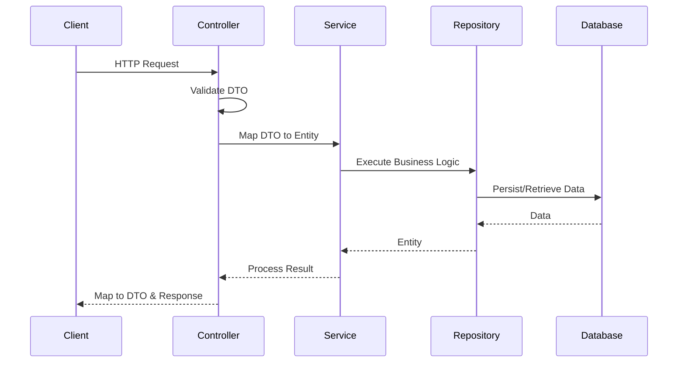

# Реализация архитектуры приложения

## 1. Архитектурный подход

В проекте используется многослойная архитектура (Layered Architecture) с элементами Domain-Driven Design (DDD). Такой подход был выбран для обеспечения:

- Чёткого разделения ответственности между компонентами
- Изоляции бизнес-логики от инфраструктурного кода
- Упрощения тестирования и поддержки кода
- Возможности независимого развития различных слоёв приложения

## 2. Детальный анализ слоёв

### 2.1. Store слой (Слой данных)

Отвечает за хранение и доступ к данным. Включает сущности, репозитории и перечисления.

#### 2.1.1. Сущности (entities)

Рассмотрим пример сущности Recipe:

```java
@Entity
@Table(name = "recipe")
public class RecipeEntity {
    @Id
    @GeneratedValue(strategy = GenerationType.IDENTITY)
    Long id;

    @Column(nullable = false)
    String name;

    @Column(length = 1000)
    String description;

    @Builder.Default
    @OneToMany(mappedBy = "recipe", cascade = CascadeType.ALL)
    List<StepEntity> steps = new ArrayList<>();

    @ManyToOne(fetch = FetchType.LAZY)
    @JoinColumn(name = "author_id")
    UserEntity author;

    @ManyToMany(mappedBy = "favoriteRecipes")
    Set<UserEntity> likedByUsers = new HashSet<>();
}
```

Особенности реализации:
1. Использование JPA аннотаций для маппинга объектов на таблицы БД
2. Применение паттерна Builder через Lombok для упрощения создания объектов
3. Реализация связей между сущностями:
   - OneToMany для шагов рецепта
   - ManyToOne для автора
   - ManyToMany для пользователей, добавивших рецепт в избранное
4. Ленивая загрузка (LAZY) для оптимизации производительности

### 2.2. API слой

#### 2.2.1. DTO (Data Transfer Objects)

Объекты передачи данных используются для безопасной передачи информации между слоями. Пример DTO для рецепта:

```java
@Data
@NoArgsConstructor
@AllArgsConstructor
public class RecipeDetailsDto {
    @NotNull(message = "Id must not be null.", groups = OnUpdate.class)
    Long id;

    @NotNull(message = "Name not be null.", groups = {OnUpdate.class, OnCreate.class})
    @Length(max = 255)
    String name;

    @NotNull(message = "Description not be null.")
    @Length(max = 1000)
    String description;

    @NotNull(message = "Brewing method not be null.")
    BrewingMethod brewingMethod;

    @NotNull(message = "Steps not be null.")
    List<StepDto> steps;
}
```

Ключевые особенности:
1. Валидация данных с использованием Bean Validation
2. Группы валидации для разных сценариев (создание/обновление)
3. Использование Lombok для автогенерации кода
4. Ограничение длины полей для защиты от переполнения

#### 2.2.2. Mappers

Для преобразования между DTO и сущностями используется MapStruct:

```java
@Mapper(componentModel = "spring")
public interface RecipeMapper extends Mappable<RecipeEntity, RecipeDetailsDto> {
    @Mapping(target = "liked", expression = "java(isRecipeLikedByCurrentUser(entity))")
    @Mapping(target = "authorName", source = "author.username")
    RecipeDetailsDto toDto(RecipeEntity entity);

    default boolean isRecipeLikedByCurrentUser(RecipeEntity recipe) {
        Authentication authentication = SecurityContextHolder.getContext().getAuthentication();
        if (authentication == null) {
            return false;
        }
        String currentEmail = authentication.getName();
        return recipe.getLikedByUsers().stream()
                .map(UserEntity::getEmail)
                .anyMatch(email -> email.equals(currentEmail));
    }
}
```

Преимущества использования MapStruct:
1. Автоматическая генерация кода маппинга
2. Типобезопасность
3. Возможность добавления кастомной логики
4. Интеграция с Spring компонентами

#### 2.2.3. Services

Сервисы реализуют бизнес-логику приложения:

```java
@Service
@Transactional
public class RecipeService {
    private final RecipeRepository recipeRepository;
    private final UserService userService;

    public RecipeEntity create(RecipeEntity recipe, Long userId) {
        UserEntity user = userService.getById(userId);
        recipe.setAuthor(user);
        recipe.getSteps().forEach(step -> step.setRecipe(recipe));
        return recipeRepository.save(recipe);
    }

    public void addRecipeToFavorite(Long recipeId, Long userId) {
        UserEntity user = userService.getById(userId);
        RecipeEntity recipe = getById(recipeId);
        recipe.addLikedByUser(user);
        recipeRepository.save(recipe);
    }
}
```

Особенности реализации:
1. Транзакционное управление
2. Инкапсуляция бизнес-логики
3. Использование репозиториев для доступа к данным
4. Взаимодействие между различными доменными объектами

### 2.3. Security слой

#### 2.3.1. JWT Authentication

Реализация безопасности на основе JSON Web Tokens:

```java
@Configuration
@EnableWebSecurity
@EnableMethodSecurity
public class SecurityConfig {
    private final JwtTokenProvider jwtTokenProvider;

    @Bean
    SecurityFilterChain filterChain(HttpSecurity http) throws Exception {
        return http
                .csrf(AbstractHttpConfigurer::disable)
                .sessionManagement(session -> 
                    session.sessionCreationPolicy(SessionCreationPolicy.STATELESS))
                .authorizeHttpRequests(configurer ->
                    configurer.requestMatchers("/api/auth/**", "/api/recipes/**")
                            .permitAll()
                            .anyRequest().authenticated())
                .addFilterBefore(new JwtTokenFilter(jwtTokenProvider),
                        UsernamePasswordAuthenticationFilter.class)
                .build();
    }
}
```

Особенности реализации безопасности:
1. Stateless аутентификация с использованием JWT
2. Отключение CSRF для REST API
3. Настройка публичных и защищенных эндпоинтов
4. Кастомный фильтр для обработки JWT токенов

```java
public class JwtTokenFilter extends GenericFilterBean {
    private final JwtTokenProvider jwtTokenProvider;

    @Override
    public void doFilter(ServletRequest request, ServletResponse response, 
                        FilterChain chain) throws IOException, ServletException {
        String token = getTokenFromRequest((HttpServletRequest) request);
        if (token != null && jwtTokenProvider.isValid(token)) {
            Authentication auth = jwtTokenProvider.getAuthentication(token);
            SecurityContextHolder.getContext().setAuthentication(auth);
        }
        chain.doFilter(request, response);
    }
}
```

#### 2.3.2. Процесс аутентификации

```java
@RestController
@RequestMapping("/api/auth")
public class AuthController {
    private final AuthService authService;
    private final UserService userService;
    private final UserMapper userMapper;

    @PostMapping("/register")
    public UserDto register(@Validated(OnCreate.class) @RequestBody UserDto userDto) {
        UserEntity user = userMapper.toEntity(userDto);
        UserEntity createdUser = userService.create(user);
        return userMapper.toDto(createdUser);
    }

    @PostMapping("/login")
    public JwtResponse login(@Validated @RequestBody JwtRequest loginRequest) {
        return authService.login(loginRequest);
    }
}
```

Процесс аутентификации включает:
1. Регистрацию нового пользователя
2. Вход с получением JWT токена
3. Использование токена для последующих запросов
4. Обновление токена при необходимости

## 3. Взаимодействие между слоями



1. Client отправляет HTTP запрос
2. Controller валидирует входные данные через DTO
3. Service реализует бизнес-логику
4. Repository взаимодействует с базой данных
5. Результат преобразуется обратно в DTO

## 4. Паттерны проектирования

### 4.1. DTO (Data Transfer Object)
- Защита внутренней модели данных
- Контроль передаваемых данных
- Оптимизация сетевых запросов

### 4.2. Repository
- Абстракция доступа к данным
- Централизованное управление данными
- Упрощение тестирования

### 4.3. Builder
- Упрощение создания сложных объектов
- Улучшение читаемости кода
- Иммутабельность объектов

### 4.4. Mapper
- Преобразование между слоями
- Изоляция изменений
- Типобезопасность

### 4.5. Filter Chain
- Последовательная обработка запросов
- Разделение ответственности
- Гибкость конфигурации

## 5. Заключение

Выбранная архитектура обеспечивает:
1. Модульность и расширяемость системы
2. Четкое разделение ответственности
3. Безопасность и контроль доступа
4. Удобство тестирования
5. Масштабируемость приложения

Используемые паттерны и практики способствуют:
- Уменьшению связанности компонентов
- Повышению читаемости и поддерживаемости кода
- Упрощению внесения изменений
- Улучшению тестируемости системы